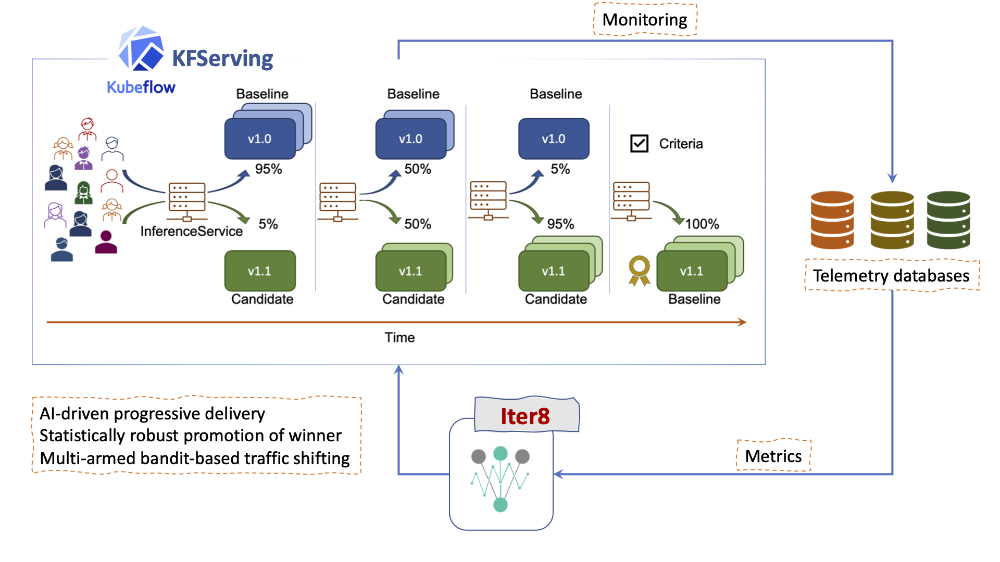

# Iter8-kfserving
> Iter8-kfserving enables metrics and AI-driven live experiments, progressive delivery, and automated rollouts for ML models in production over Kubernetes and OpenShift clusters.

The picture below illustrates progressive delivery of a KFServing model using iter8.



## Table of Contents
- [Quick start on Minikube](#Quick-start-on-Minikube)
- [Installation](./docs/installation.md)
- [Anatomy of an iter8 experiment](./docs/experimentanatomy.md)
- [Progressive canary release experiment](./docs/canary.md)
- Iter8 metrics
  * [Using metrics in experiments](./docs/usingmetrics.md)
  * [Out-of-the-box metrics](./docs/metrics_ootb.md)
  * [Anatomy of iter8 metrics](./docs/metricsanatomy.md)
  * [Defining a custom metric](./docs/metrics_custom.md)
- [Concurrent experiments](./docs/concurrency.md)
- Reference
  * [Experiment resource object](./docs/experimentcrd.md)
  * [Metric resource object](./docs/metricscrd.md)
- [Wiki with roadmap and developer documentation](https://github.com/iter8-tools/iter8-kfserving/wiki)
- [Contributing](./docs/contributing.md)

## Quick start on Minikube
Steps 1 through 8 demonstrate metrics-driven progressive canary release of a KFServing model using iter8.

**Step 1:** Start Minikube with sufficient resources.
```shell
minikube start --cpus 4 --memory 12288 --kubernetes-version=v1.17.11 --driver=docker
```

**Step 2:** Install KFServing, iter8-kfserving, and iter8-monitoring. This step requires [Kustomize v3](https://kubectl.docs.kubernetes.io/installation/kustomize/).
```shell
curl -L https://raw.githubusercontent.com/iter8-tools/iter8-kfserving/main/samples/quickstart/platformsetup.sh | /bin/bash
```

**Step 3:** *In a separate terminal,* setup Minikube tunnel. If prompted, enter password.
```shell
minikube tunnel --cleanup
```

**Step 4:** Create InferenceService object with `default` and `canary` model versions. Wait until it is ready.
```shell
curl -L https://raw.githubusercontent.com/iter8-tools/iter8-kfserving/main/samples/quickstart/inferenceservicesetup.sh | /bin/bash
```

**Step 5:** *In a separate terminal,* send prediction requests to model versions.
```shell
curl -L https://raw.githubusercontent.com/iter8-tools/iter8-kfserving/main/samples/quickstart/predictionrequests.sh | /bin/bash
```

**Step 6:** Create the canary release experiment.
```shell
kubectl apply -f https://raw.githubusercontent.com/iter8-tools/iter8-kfserving/main/samples/experiments/example1.yaml -n kfserving-test
```

**Step 7:** Watch the InferenceService object as the canary version is progressively rolled out.
```shell
kubectl get inferenceservice -n kfserving-test --watch
```

You should see output similar to the following.
```shell
NAME           URL                                              READY   DEFAULT TRAFFIC   CANARY TRAFFIC   AGE
sklearn-iris   http://sklearn-iris.kfserving-test.example.com   True    95                5                112s
sklearn-iris   http://sklearn-iris.kfserving-test.example.com   True    95                5                2m47s
sklearn-iris   http://sklearn-iris.kfserving-test.example.com   True    85                15               2m47s
sklearn-iris   http://sklearn-iris.kfserving-test.example.com   True    85                15               3m10s
sklearn-iris   http://sklearn-iris.kfserving-test.example.com   True    75                25               3m11s
sklearn-iris   http://sklearn-iris.kfserving-test.example.com   True    75                25               3m33s
sklearn-iris   http://sklearn-iris.kfserving-test.example.com   True    65                35               3m33s
sklearn-iris   http://sklearn-iris.kfserving-test.example.com   True    65                35               3m55s
sklearn-iris   http://sklearn-iris.kfserving-test.example.com   True    55                45               3m56s
sklearn-iris   http://sklearn-iris.kfserving-test.example.com   True    55                45               3m59s
sklearn-iris   http://sklearn-iris.kfserving-test.example.com   True    100                                4m
sklearn-iris                                                    False                                      4m
sklearn-iris                                                    False                                      4m
sklearn-iris                                                    False                                      4m34s
sklearn-iris                                                    False                                      4m35s
sklearn-iris                                                    False                                      4m35s
sklearn-iris   http://sklearn-iris.kfserving-test.example.com   True    100                                4m36s
```

**Step 8:** *In a separate terminal,* watch the Experiment object.
```shell
kubectl get experiment -n kfserving-test --watch
```

You should see output similar to the following.
```shell
kubectl get experiment -n kfserving-test --watch
NAME                        TYPE     TARGET                        COMPLETED ITERATIONS   MESSAGE
sklearn-iris-experiment-1   Canary   kfserving-test/sklearn-iris   0                      ExperimentInitialized: Late initialization complete
sklearn-iris-experiment-1   Canary   kfserving-test/sklearn-iris   1                      IterationUpdate: Completed Iteration 1
sklearn-iris-experiment-1   Canary   kfserving-test/sklearn-iris   2                      IterationUpdate: Completed Iteration 2
sklearn-iris-experiment-1   Canary   kfserving-test/sklearn-iris   3                      IterationUpdate: Completed Iteration 3
sklearn-iris-experiment-1   Canary   kfserving-test/sklearn-iris   4                      IterationUpdate: Completed Iteration 4
sklearn-iris-experiment-1   Canary   kfserving-test/sklearn-iris   5                      IterationUpdate: Completed Iteration 5
sklearn-iris-experiment-1   Canary   kfserving-test/sklearn-iris   6                      IterationUpdate: Completed Iteration 6
sklearn-iris-experiment-1   Canary   kfserving-test/sklearn-iris   7                      IterationUpdate: Completed Iteration 7
sklearn-iris-experiment-1   Canary   kfserving-test/sklearn-iris   8                      IterationUpdate: Completed Iteration 8
sklearn-iris-experiment-1   Canary   kfserving-test/sklearn-iris   9                      IterationUpdate: Completed Iteration 9
sklearn-iris-experiment-1   Canary   kfserving-test/sklearn-iris   10                     ExperimentCompleted: Experiment completed successfully
```

At this point, if you inspect the InferenceService object (`kubectl get inferenceservice -n kfserving-test -o yaml`), you can see that the canary version (`flowers-2`) has been promoted as the new default.